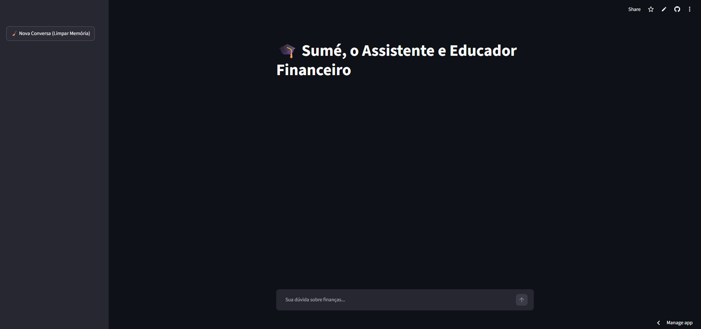
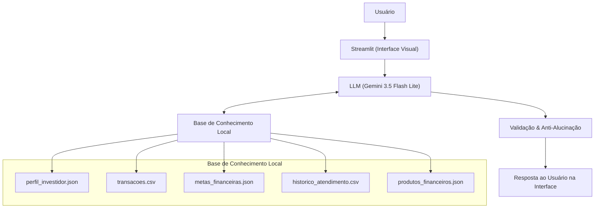

# 💰 Sumé - Assistente e Educador de Investimentos


## Chat disponível em:
<a href="https://dio-lab-bia-do-futuro-sume.streamlit.app/" target="_blank">
  
</a>

> Agente de IA Generativa focado em controle de gastos, educação financeira básica e planejamento de metas pessoais, desenvolvido como parte do **Bootcamp Bradesco - GENAI & Dados** na [DIO](https://www.dio.me/).

---

## 💡 O Que é o Sumé?

O **Sumé** é um assistente financeiro pessoal inteligente que orienta os usuários no controle de orçamento, acompanhamento de metas financeiras e conceitos sobre investimentos. 

A partir da base contextual de dados do usuário (histórico de transações, metas, perfil e histórico de atendimento), o agente utiliza o **Gemini 3.5 Flash Lite** para gerar respostas altamente personalizadas, alertas em tempo real e relatórios educativos.

### **O que o Sumé faz:**
- ✅ **Análise de Gastos e Alertas:** Monitora transações por categoria (`transacoes.csv`) e alerta automaticamente sobre o orçamento e extrapolação de limites.
- ✅ **Acompanhamento de Metas:** Avalia o progresso de metas financeiras (`metas_financeiras.json`), exibindo percentuais de conclusão e prazos estipulados.
- ✅ **Perfil do Investidor & Produtos:** Consulta o perfil (`perfil_investidor.json`) e a base de produtos (`produtos_financeiros.json`) para tirar dúvidas e sugerir categorias e conceitos alinhados à tolerância a risco.
- ✅ **Educação Financeira Personalizada:** Explica conceitos básicos (reserva de emergência, juros compostos, diversificação, etc.) de forma clara e adaptada ao momento financeiro.
- ✅ **Isolamento de Sessão:** A permissão de acesso a históricos, saldos e investimentos é por sessão.

### **O que o Sumé NÃO faz:**
- ❌ **Não realiza recomendação direta ou venda de investimentos específicos** (funciona estritamente como agente educativo/consultivo).
- ❌ **Não acessa ou conecta a contas bancárias reais/sensíveis** (trabalha com bases estruturadas simuladas/fornecidas).
- ❌ **Não compartilha histórico ou dados entre usuários/sessões distintas.**
- ❌ **Não acessa histórico ou dados quando não lhe é permitido.**
- ❌ **Não substitui a orientação técnica de um consultor ou profissional financeiro certificado.**

---

## 🏗️ Arquitetura



---

**Stack:**
- Interface: [Streamlit](https://streamlit.io/)
- LLM: Gemini 3.5 Flash Lite via [Google AI API](https://ai.google.dev/)
- Dados: JSON/CSV
- Segurança: API Key protegida via variável de ambiente `.env`

---

## Estrutura do Repositório

```
📁 lab-agente-financeiro/
│
├── 📄 README.md
│
├── 📁 data/                            # Dados mockados para o agente
│   ├── historico_atendimento.csv       # Histórico de atendimentos (CSV)
│   ├── perfil_investidor.json          # Perfil do cliente (JSON)
│   ├── produtos_financeiros.json       # Produtos disponíveis (JSON)
│   ├── sigla_informativos.json         # Informações de algumas siglas de investimento (JSON)
│   └── transacoes.csv                  # Histórico de transações (CSV)
│
├── 📁 docs/                            # Documentação do projeto
│   ├── 01-documentacao-agente.md       # Caso de uso e arquitetura
│   ├── 02-base-conhecimento.md         # Estratégia de dados
│   ├── 03-prompts.md                   # Engenharia de prompts
│   ├── 04-metricas.md                  # Avaliação e métricas
│   └── 05-pitch.md                     # Roteiro do pitch
│
├── 📁 src/                             # Código da aplicação
│   └── app.py                          # Aplicação streamlit
│
├── 📁 assets/                          # Imagens e diagramas
│   └── ...
│
└── 📁 examples/                        # Referências e exemplos
    └── README.md
```

## 🚀 Como Executar

### 1. Configurar a API Key

Crie um arquivo `.env` na raiz do projeto:

```
echo "GEMINI_API_KEY=sua_key_aqui" > .env

echo "# Seguranca
.env

# Ambientes Virtuais
.venv/
venv/
env/" >> .gitignore
```

> 🔑 Obtenha sua key gratuita em [aistudio.google.com](https://aistudio.google.com)  
> ⚠️ Nunca suba o arquivo `.env` para o repositório! Por isso o comando echo com o ">> .gitignore"!

### 2. Instalar Dependências

```
bash
pip install streamlit pandas google-genai python-dotenv
```

### 3. Rodar a Aplicação

```
bash
streamlit run src/app.py
```
## 🎯 Exemplos de Uso

**Pergunta:** 
```Como estão meus gastos este mês? ``` 
**Sumé:** 
```O IPCA significa Índice de Preços ao Consumidor Amplo. Na prática, ele é o oficial da inflação no Brasil, calculado e divulgado mensalmente pelo IBGE.

O que o IPCA mede?
Ele mede a variação dos preços de um conjunto de produtos e serviços consumidos pelas famílias brasileiras no dia a dia, como:

Alimentação (supermercado, feira, restaurantes)
Habitação (aluguel, conta de luz, água)
Transporte (combustível, passagens)
Saúde, educação, vestuário, entre outros.
Quando dizemos que a inflação está em 4% ao ano, por exemplo, significa que, em média, o custo de vida subiu 4% nesse período. Ou seja, com o mesmo dinheiro, você consegue comprar menos coisas do que antes se o seu dinheiro não estiver rendendo pelo menos o valor da inflação.

Como o IPCA afeta os seus investimentos?
Alguns investimentos são atrelados ao IPCA (como o Tesouro IPCA+ ou Debêntures Incentivadas). Eles funcionam como uma proteção para o seu poder de compra:

Rentabilidade híbrida: Esses investimentos pagam uma taxa fixa (exemplo: IPCA + 5% ao ano) mais a variação da inflação do período.
O que isso significa? Significa que o seu dinheiro sempre vai render acima da inflação. Se a inflação subir, o seu rendimento acompanha e ainda entrega o ganho real da taxa fixa contratada.
Lembrando que qualquer projeção de ganhos futuros com base na inflação é apenas uma estimativa com os índices atuais, combinado?

Tem alguma dúvida sobre como a inflação impacta o seu planejamento ou quer ver um exemplo prático de investimento atrelado ao IPCA?
```
--- 

**Pergunta:** ```Se eu investir 200 reais por mês em IPCA, quanto eu terei em 1 ou 3 anos?```  
**Sumé:** 
```
Olá, João!

Com base no seu objetivo principal de construir a sua reserva de emergência, precisamos fazer um ajuste importante antes de falarmos sobre aportes em produtos atrelados ao IPCA:

⚠️ Atenção à Reserva de Emergência: Como o seu perfil é moderado e você ainda está construindo sua base de segurança, o ideal é que os seus aportes mensais iniciais (como esses R$ 200,00) sejam direcionados para ativos de baixo risco e alta liquidez (como o Tesouro Selic ou o CDB Liquidez Diária), e não diretamente para títulos atrelados ao IPCA. O Tesouro IPCA+, por exemplo, é excelente para objetivos de longo prazo, mas pode oscilar se você precisar resgatar o dinheiro antes do vencimento (o que não é ideal para uma reserva de emergência).

De qualquer forma, para fins didáticos e para te mostrar como funcionam os cálculos, vamos simular o investimento de R$ 200,00 por mês em uma opção de baixo risco e rentabilidade pós-fixada (como o Tesouro Selic, considerando uma taxa Selic estimada em torno de 10,65% ao ano), lembrando que estes valores são apenas estimativas com base nos índices atuais e não garantias de rendimento:

Simulação de R$ 200,00 por mês (Exemplo com Tesouro Selic):
Prazo: 1 ano

Valor total depositado do seu bolso: R$ 2.400,00
Rendimento estimado (já considerando o Imposto de Renda): aproximadamente R$ 2.535,00
O seu lucro líquido seria de cerca de R$ 135,00 gerado pela ação dos juros compostos.
Prazo: 3 anos

Valor total depositado do seu bolso: R$ 7.200,00
Rendimento estimado (já considerando o Imposto de Renda): aproximadamente R$ 8.080,00
O seu lucro líquido seria de cerca de R$ 880,00.
E se fosse em um título IPCA+? (Exemplo didático)
Caso você decida investir no Tesouro IPCA+ para um objetivo de médio/longo prazo (como a sua meta de entrada do apartamento, por exemplo), a lógica é diferente: o dinheiro rende a inflação do período mais uma taxa fixa contratada.

Como não temos acesso ao valor exato do seu patrimônio ou da sua meta sem a sua autorização de extrato, reforço que o primeiro passo recomendado para o seu perfil moderado é garantir que a sua reserva de emergência esteja completa em uma aplicação de liquidez diária (como o Tesouro Selic ou CDB Liquidez Diária).

Quer que eu te ajude a simular os aportes mensais de R$ 200,00 focados na construção da sua reserva de emergência?
```

## 📊 Métricas e Avaliação

| Métrica | Objetivo |
|---------|----------|
| **Assertividade** | O agente responde o que foi perguntado. |
| **Segurança** | Evitou inventar informações (anti-alucinação), sair do escopo de finanças e consultar históricos de transações, renda e dinheiro guardado sem autorização. |
| **Coerência** | As resposta consideram o contexto que o usuário pede |


## 🎬 Diferenciais em Relação ao Projeto Original

| Item | Original (Edu) | Sumé |
|------|---------------|-----------|
| LLM | Ollama (local) | Gemini 3.5 Flash Lite (API) |
| Histórico | Sempre acessível | Acessável por autorização |
| Siglas e informativos | Não tinha | `siglas_informativos.json` |
| Foco | Educação financeira | Assistente e educador de investimentos  |

## 🔮 Melhorias Futuras

- **Aumentar quantidade de usuários**: aumentar a quantidade de clientes e configurar o acesso aos dados somente de clientes iguais, ex.: id do João é USR01, a LLM só pode fazer as consultas em `perfil_investido.json` se o id do cliente do chat e no json forem USR01, qualquer outro é negado na hora.
- **Gráficos dos investimentos**: visualizações interativas do rendimento com Plotly, tanto de previsão quanto de rentabilidade até o momento, fazendo a diferenciação entre esperado e real.

## 📝 Documentação Completa

Toda a documentação técnica está disponível na pasta [`docs/`](./docs/).
